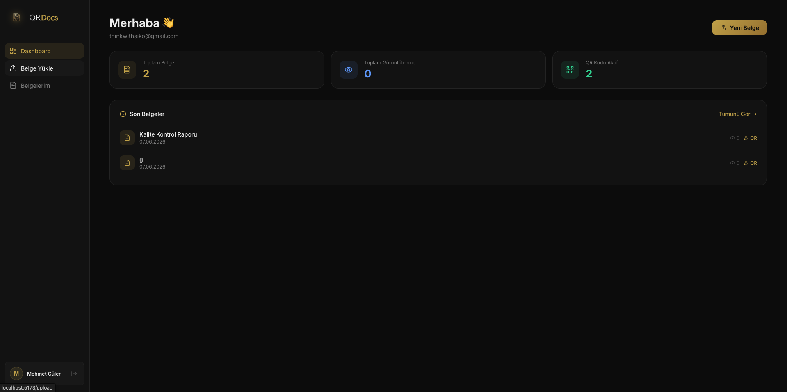

# QRDocs

**QRDocs** is a premium document management platform that automatically generates QR codes for uploaded documents. Scan a QR code to instantly access any document in the browser — no app installation required.

## ✨ Features

- 📄 Upload PDF or image documents (drag & drop)
- 🔗 Auto-generate unique QR codes for every document
- 📱 Scan QR → view document in browser (no app needed)
- 🔐 Secure authentication (email & password)
- 📊 Dashboard with document stats & view counts
- 🗑️ Delete documents (removes file, QR code & metadata)
- 🌙 Premium dark gold UI

## 📸 Screenshots

### Login


### Dashboard


### Document View Page (QR Scan)


## 🛠️ Tech Stack

| Layer | Technology |
|-------|-----------|
| Frontend | React 19 + Vite |
| Auth | Firebase Authentication |
| Database | Cloud Firestore |
| Storage | Firebase Storage |
| Hosting | Firebase Hosting / Vercel |
| QR Generation | `qrcode` (browser-side) |
| Styling | CSS Modules |

## 🚀 Getting Started

### Prerequisites
- Node.js 18+
- Firebase project (Blaze plan for Storage)

### Installation

```bash
git clone https://github.com/kkbradd/qrdocs.git
cd qrdocs
npm install
```

### Firebase Setup

Create a `.env.local` file:

```env
VITE_FIREBASE_API_KEY=your_api_key
VITE_FIREBASE_AUTH_DOMAIN=your_project.firebaseapp.com
VITE_FIREBASE_PROJECT_ID=your_project_id
VITE_FIREBASE_STORAGE_BUCKET=your_project.firebasestorage.app
VITE_FIREBASE_MESSAGING_SENDER_ID=your_sender_id
VITE_FIREBASE_APP_ID=your_app_id
```

### Run Locally

```bash
npm run dev
```

### Build & Deploy

```bash
npm run build
```

## 📁 Project Structure

```
src/
├── components/       # Layout, Sidebar
├── context/          # AuthContext
├── lib/              # Firebase config
├── pages/            # Dashboard, Upload, Documents, DocView, Login
└── index.css         # Global styles & design tokens
```

## 🔐 Firestore Security Rules

```
match /documents/{docId} {
  allow read: if true;
  allow create: if request.auth != null && request.auth.uid == request.resource.data.uid;
  allow update, delete: if request.auth != null && request.auth.uid == resource.data.uid;
}
```

## 👤 Contributors

- [@kkbradd](https://github.com/kkbradd) — Kübra Güler

## 📄 License

MIT
